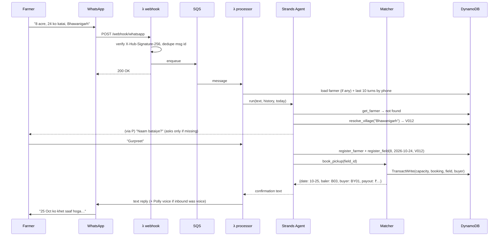
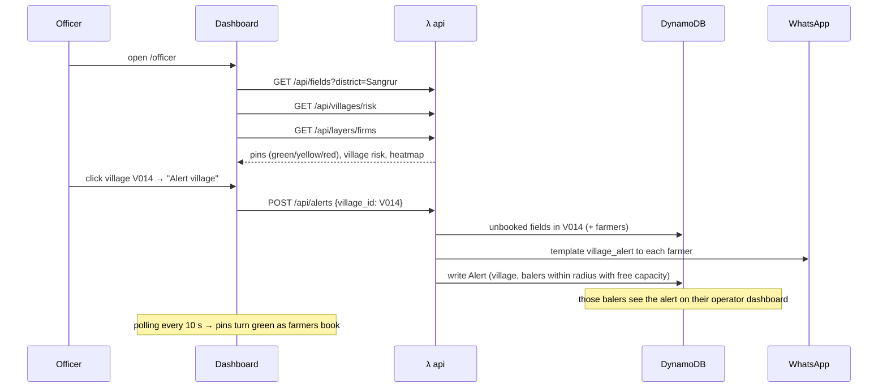

# ClearSky: Implementation Guide

This is the technical source of truth. If `PLAN.md` and this file disagree, **this file wins on design** and **PLAN.md wins on order of work**. `CONTEXT.md` summarises the current state and must be updated whenever this file changes.

---

## 1. System Overview

| Component | Type | Responsibility |
|---|---|---|
| `webhook` | Lambda (API GW) | Verify Meta webhook, check signature, dedupe, enqueue to SQS, return 200 fast |
| `processor` | Lambda (SQS) | Farmer messages only: voice → text; run the farmer agent; send reply (text + voice) |
| `api` | Lambda (API GW, JWT) | REST for dashboard: fields, risk, alerts, buyers, operator dashboard (stops, done, profile), stats, demo clock |
| `risk_job` | Lambda (Scheduler, hourly) | Recompute field and village risk scores |
| `reminders` | Lambda (Scheduler, daily 18:00 IST) | Farmer harvest confirmations and pickup notices (WhatsApp) |
| `firms_ingest` | Lambda / script | Pull NASA FIRMS fire points → GeoJSON in S3 → village fire-history scores |
| `ndvi_harvest` | Script (stretch) | Sentinel-2 NDVI change → harvested grid GeoJSON in S3 |
| Dashboard | React SPA (Amplify) | Officer radar, buyer view, operator dashboard, impact page |

Shared Python package: `backend/src/clearsky` (models, repos, domain logic, agent, channels).

### 1.1 Channel boundary

| Channel | Who | What happens there |
|---|---|---|
| **WhatsApp** | Farmers only | The agent collects name, village, acres and harvest date; books through backend tools; replies with what the tools return. Also: reminders, harvest confirmation (HAAN/NAHI), "field cleared" notice, officer village-alert offers. |
| **Web dashboard** | Officers, buyers, baler operators | All non-farmer work. Operators sign in, see stops, mark Done, set capacity/availability. No WhatsApp messages go to operators or buyers. |

Every inbound WhatsApp sender is treated as a farmer (new numbers go through onboarding). There is no operator command handler and no role routing in the processor.

### 1.2 Monorepo

One Git repository holds `backend/`, `infra/`, `dashboard/`, `data/`, `satellite/` and `video/`. The root `Makefile` runs backend and infra tasks; `dashboard/` uses its own `npm` scripts. API request/response shapes live in `backend/src/clearsky/models/` and are mirrored by hand in `dashboard/src/api/types.ts`; change both in the same commit.

---

## 2. End-to-End Flows

### 2.1 Farmer: first contact and booking (text)



### 2.2 Voice pipeline

```
inbound audio (ogg/opus, media_id)
 → GET graph/{media_id} → url → GET url (Bearer) → bytes
 → S3 media/in/{msg_id}.ogg
 → Transcribe StartTranscriptionJob(MediaFormat=ogg, LanguageCode=hi-IN)
 → poll GetTranscriptionJob (≤ 60 s, 1.5 s interval) → transcript JSON from S3
 → agent(text)
 → Polly SynthesizeSpeech(Kajal, neural, hi-IN, mp3) → S3 media/out/{msg_id}.mp3
 → presigned URL (1 h) → send audio {link} + send text
```

- Immediately after enqueueing a voice note, send a quick text: "🎙️ Sun raha hoon…" ("Listening…").
- If transcription fails or is empty, reply: "Awaaz saaf nahi aayi, kripya dobara bolein ya likhein." ("The audio wasn't clear, please speak again or type.")

### 2.3 Harvest confirmation and reminders

```
reminders λ (daily 18:00 IST):
  1. fields where harvest_date == tomorrow and status in {REGISTERED, BOOKED}
     → template pickup_reminder: "Kal katai? Baler {date} ko aayega. HAAN / NAHI"
  2. bookings where date == tomorrow → farmer: "Kal baler aayega"
  (Operators get no message: tomorrow's stops are already on their dashboard.)
Farmer replies:
  "haan" → confirm_harvest → field.status = HARVESTED (if not booked) or stays BOOKED with harvest_confirmed=true
  "nahi"/new date → agent reschedules (cancel + rebook)
```

### 2.4 Baler operator (dashboard only)

```
Operator signs in on the dashboard (Cognito group: operator, custom:baler_id) → /operator
  GET  /api/operator/me                 → baler profile (acres_per_day, radius_km, active, chc_name)
  PUT  /api/operator/me                 → update acres_per_day / active (affects new bookings only)
  GET  /api/operator/me/route?date=     → ordered stops (farmer name + phone for the call button,
                                          village, acres) + Amazon Location route polyline
  GET  /api/operator/me/alerts          → open village alerts within this baler's radius
  POST /api/bookings/{id}/done          → booking.status=DONE, field.status=CLEARED,
                                          buyer.received_tonnes += est_tonnes,
                                          farmer gets WhatsApp "Khet saaf ho gaya ✅"
The API only returns bookings whose baler_id == the caller's custom:baler_id.
Operators never receive WhatsApp messages.
```

### 2.5 Buyer

```
Buyer logs in (Cognito group: buyer, custom:buyer_id)
 → GET /api/buyers/me/supply → booked tonnes by date, delivered, remaining demand
 → PUT /api/buyers/me/demand {demand_tonnes, price_per_tonne, max_radius_km}
Matcher uses current demand/price for new bookings only (existing bookings keep their price).
```

### 2.6 Officer: Burn Risk Radar and alerts



### 2.7 Risk scoring job (hourly)

```
for each field with status in {REGISTERED, HARVESTED}:
    compute risk (see §6) → write risk_score, risk_level, risk_reasons
for each village: aggregate (unbooked_acres, red_count, max_score) → Villages.risk_*
```

### 2.8 FIRMS ingest

```
fetch VIIRS points for district bbox, Oct 1 – Nov 30, years 2022–2025
 → data/layers/firms_2022_2025.geojson → S3 layers/
 → per village: count points within VILLAGE_RADIUS_KM (default 3 km)
 → normalise 0–1 (min-max across district) → Villages.fire_history_score
```

### 2.9 Satellite harvest detection (stretch)

```
Sentinel-2 L2A (Earth Search STAC, AWS Open Data), one block bbox
 → two scenes: T1 (pre-harvest, ~early Oct), T2 (latest cloud-free)
 → NDVI = (B08 - B04) / (B08 + B04), cloud mask via SCL
 → 500 m grid; cell harvested if mean NDVI drop ≥ 0.25 and NDVI(T2) < 0.35
 → harvest_grid.geojson {cell_id, harvested_frac, est_acres}
 → village layer: est_harvested_acres − booked_acres = "unregistered at-risk acres"
```

---

## 3. Data Model (DynamoDB, on-demand)

Table names are prefixed with the stack name, e.g. `clearsky-dev-Fields`.

### 3.1 Tables

| Table | PK | SK | GSIs | Notes |
|---|---|---|---|---|
| `Villages` | `village_id` | – | `district-index` (district) | name, name_hi, name_pa, aliases[], block, district, lat, lng, fire_history_score, risk_* aggregates |
| `Farmers` | `phone` (E.164) | – | `village-index` | name, village_id, language, created_at |
| `Fields` | `field_id` | – | `village-index` (village_id, harvest_date), `farmer-index` (phone), `status-index` (status, risk_score) | see 3.2 |
| `Balers` | `baler_id` | – | – | operator_name, operator_phone (shown to farmers/officers only, never used for WhatsApp), base_village_id, lat, lng, acres_per_day, radius_km, active, chc_name. Linked to a Cognito user via `custom:baler_id`. |
| `BalerDays` | `baler_id` | `date` | – | booked_acres, capacity_acres, stop_count (capacity ledger) |
| `Buyers` | `buyer_id` | – | – | name, type, lat, lng, price_per_tonne, demand_tonnes, reserved_tonnes, received_tonnes, max_radius_km |
| `Bookings` | `booking_id` | – | `baler-date-index` (baler_id, date), `field-index`, `buyer-index` (buyer_id, date), `date-index` (date) | see 3.2 |
| `Conversations` | `phone` | `ts` | – | role, text, TTL 7 days |
| `ProcessedMessages` | `wa_message_id` | – | – | TTL 2 days (idempotency) |
| `Alerts` | `alert_id` | – | `village-index` | officer_id, village_id, farmers_notified, balers_flagged[] (baler_ids shown the alert on their dashboard), status (OPEN/CLOSED), created_at |
| `Settings` | `key` | – | – | e.g. `clock` → `{today: "2026-10-24"}` in demo mode |

### 3.2 Key items

**Field**
```json
{
  "field_id": "F-8c1a…",
  "phone": "+919800000001",
  "village_id": "V012",
  "acres": 8,
  "lat": 30.2061, "lng": 76.0412,
  "harvest_date": "2026-10-24",
  "sowing_deadline": "2026-11-13",
  "harvest_confirmed": false,
  "status": "BOOKED",
  "booking_id": "BK-…",
  "risk_score": 12, "risk_level": "GREEN", "risk_reasons": ["booked"],
  "source": "whatsapp",
  "created_at": "…", "updated_at": "…"
}
```
Field coordinates are the village centroid plus a small random offset, since farmers don't share GPS. If a farmer shares a WhatsApp location, store that instead.

**Booking**
```json
{
  "booking_id": "BK-…",
  "field_id": "F-…", "phone": "+91…", "village_id": "V002",
  "baler_id": "B03", "buyer_id": "BY01",
  "date": "2026-10-25", "stop_order": 2,
  "acres": 8, "est_tonnes": 20.0,
  "lat": 30.27, "lng": 76.03,
  "buyer_price_per_tonne": 1800,
  "farmer_payout": 0,
  "status": "CONFIRMED",
  "created_at": "…"
}
```

### 3.3 State machines

**Field.status**
```
REGISTERED ──(harvest confirmed / date passed)──► HARVESTED
REGISTERED ──(booked before harvest)────────────► BOOKED
HARVESTED  ──(booked)───────────────────────────► BOOKED
BOOKED     ──(operator done)────────────────────► CLEARED
BOOKED     ──(cancelled)────────────────────────► HARVESTED | REGISTERED
any non-CLEARED ──(FIRMS point ≤ 500 m after harvest / officer mark)──► FIRE_REPORTED
```

**Booking.status:** `CONFIRMED → DONE` or `CONFIRMED → CANCELLED`

---

## 4. Matching Algorithm (`domain/matching.py`)

Pure functions plus one transactional commit.

```
def book_pickup(field):
    window_start = max(field.harvest_date + 1 day, today + 1 day)
    window_end   = field.sowing_deadline - SOWING_BUFFER_DAYS (default 2)
    if window_start > window_end: return NoSlot("deadline too close")

    balers = active balers with haversine(field, baler.base) ≤ baler.radius_km
    candidates = []
    for baler in balers:
        for d in dates(window_start .. window_end):
            remaining = baler.acres_per_day - BalerDays[baler, d].booked_acres
            if remaining < field.acres: continue
            dist = haversine(field, baler.base)
            delay = (d - window_start).days
            cluster = 1 if baler already has a stop in field.village on d else 0
            score = W_DIST*dist + W_DELAY*delay - W_CLUSTER*cluster
            candidates.append((score, baler, d))
    if none: return NoSlot("no baler capacity")   # → risk goes up; officer sees it

    tonnes = field.acres * TONNES_PER_ACRE
    buyers = buyers with (demand - reserved) ≥ tonnes and dist ≤ buyer.max_radius_km
    buyer  = argmax(price_per_tonne - TRANSPORT_COST_PER_TONNE_KM * dist)
    if none: buyer = None (book baling anyway; straw to "village storage" pending)

    for (score, baler, d) in sorted(candidates)[:3]:     # retry next-best on conflict
        try:
            commit(field, baler, d, buyer, tonnes)          # TransactWriteItems
            return Booked(...)
        except ConditionalCheckFailed: continue
    return NoSlot("contention")
```

**Transaction `commit`** (TransactWriteItems):
1. `Update BalerDays[baler,d]` SET booked_acres = booked_acres + :a, with condition `attribute_not_exists(booked_acres) OR booked_acres <= :cap_minus_a`
2. `Put Bookings[booking_id]`, condition `attribute_not_exists(booking_id)`
3. `Update Fields[field_id]` SET status=BOOKED, booking_id, with condition `status IN (REGISTERED, HARVESTED)`
4. `Update Buyers[buyer]` SET reserved_tonnes += :t (only if a buyer was chosen). DynamoDB conditions can't do arithmetic on attributes, so the condition is `demand_tonnes = :demand AND reserved_tonnes <= :max_reserved`, where `:demand` is the value read and `:max_reserved = demand − t` is computed in code.

The cancellation reason index tells the matcher what failed: capacity (0) → try the next candidate; field (2) → the field was booked meanwhile, return that booking; buyer (3) → re-read buyers and retry.

Rules added during the build:
- A field larger than a baler's `acres_per_day` may only take an **empty** day (condition `booked_acres = 0`); otherwise it could never be booked.
- `book_pickup` on an already-booked field returns the existing booking (`already_booked=true`), so retries are safe.
- `Booking` stores `village_id`, `lat`, `lng` for the cluster bonus and stop ordering.

Defaults (in `config.py`, all overridable): `W_DIST=1.0`, `W_DELAY=2.0`, `W_CLUSTER=5.0`, `SOWING_BUFFER_DAYS=2`, `MATCHER_MAX_ATTEMPTS=3`.

**Stop order:** after commit, recompute `stop_order` for that baler-day with a nearest-neighbour ordering from the baler base.

---

## 5. Pricing and Payout (`domain/pricing.py`)

```
gross        = est_tonnes * buyer.price_per_tonne
baling_cost  = acres * BALING_COST_PER_ACRE
transport    = est_tonnes * dist_km(field, buyer) * TRANSPORT_COST_PER_TONNE_KM
farmer_payout = max(0, gross - baling_cost - transport - PLATFORM_FEE_PER_TONNE * est_tonnes)
```

- If `farmer_payout == 0`, the message says **"free clearance"** (no cost to the farmer).
- All rates are **demo parameters**, clearly labeled as such in the UI. Never present them as real market prices.

---

## 6. Risk Scoring (`domain/risk.py`)

Inputs per field: status, harvest_date, harvest_confirmed, sowing_deadline, today, village.fire_history_score, and slot availability (a cheap check: does any baler within radius have capacity before the deadline).

```
if status in {BOOKED, CLEARED}: return 0, GREEN, ["booked"/"cleared"]
harvested   = harvest_confirmed or today >= harvest_date
days_left   = (sowing_deadline - today).days
urgency     = clamp(1 - days_left / SOWING_WINDOW_DAYS, 0, 1)
no_capacity = 0 if slot_available else 1
history     = village.fire_history_score          # 0..1

base  = 0.45*urgency + 0.25*no_capacity + 0.30*history
score = round(100 * base * (1.0 if harvested else 0.35))
level = RED if score >= 70 else YELLOW if score >= 40 else GREEN
reasons = human-readable list, e.g. ["harvested 3 days ago", "6 days to sowing", "high fire history", "no baler free"]
```

Village aggregates: `unbooked_acres`, `red_fields`, `yellow_fields`, `max_score`, `village_risk = max_score`.

---

## 7. Agent Design (`agent/`)

### 7.1 Runtime

- **Strands Agents SDK** with a `BedrockModel(model_id=BEDROCK_MODEL_ID, temperature=0.2)`.
- One agent instance **per inbound message** (stateless Lambda). History is loaded from `Conversations` (last 10 turns).
- **The phone number is never an LLM argument.** Tools are built in a factory that closes over the verified sender phone, so the model cannot act on another farmer's data.

```python
from strands import Agent, tool
from strands.models import BedrockModel

def build_agent(phone: str, history: list, today: str) -> Agent:
    @tool
    def register_field(acres: float, harvest_date: str, village_id: str) -> dict:
        """Register a paddy field for this farmer. harvest_date: YYYY-MM-DD."""
        return tools_impl.register_field(phone, acres, harvest_date, village_id)
    # … other tools defined the same way …
    return Agent(
        model=BedrockModel(model_id=settings.bedrock_model_id, temperature=0.2),
        system_prompt=prompts.farmer_system(today=today),
        tools=[get_my_profile, resolve_village, register_farmer, register_field,
               book_pickup, get_my_bookings, confirm_harvest, reschedule, cancel_booking],
        messages=history,
    )
```
(Verify exact constructor arguments against the installed Strands version.)

### 7.2 Tools

| Tool | Args (LLM-visible) | Returns |
|---|---|---|
| `get_my_profile` | – | farmer + fields + bookings, or `null` |
| `resolve_village` | `name: str` | top 3 matches `{village_id, name, score}` (rapidfuzz over name/aliases/Hindi/Punjabi) |
| `register_farmer` | `name: str, village_id: str` | farmer |
| `register_field` | `acres: float, harvest_date: str, village_id: str, sowing_date?: str` | field |
| `book_pickup` | `field_id: str` | booking summary or `{no_slot, reason}` |
| `get_my_bookings` | – | list |
| `confirm_harvest` | `field_id: str` | field |
| `reschedule` | `field_id: str, new_harvest_date: str` | cancel + rebook result |
| `cancel_booking` | `booking_id: str` | ok |

Validation lives in the tools, not the prompt: acres 0.5–100, dates within season, village must exist.

### 7.3 System prompt (summary, full text in `agent/prompts.py`)

- You are ClearSky's assistant for paddy farmers in Punjab/Haryana. Today is `{today}` (Asia/Kolkata). You only talk to farmers.
- Your job: collect the farmer's details (name, village, acres, harvest date), book through the tools, and reply with a clear answer. You never contact operators, buyers or officers.
- Reply in the farmer's language (Hindi by default; Punjabi if they write Punjabi; English if English). Use **short sentences, max ~40 words**, simple words, and no jargon.
- Goal: register the field (acres, harvest date, village) and book a pickup.
- Ask only for missing information, one question at a time. Convert relative dates ("parso", "24 tareekh") into absolute dates and **repeat them back**.
- Call `book_pickup` right after the field is registered. Never invent dates, prices or payouts. Only state what tools return.
- If there's no slot, apologise, say an officer has been notified, and promise a follow-up.
- Off-topic messages: one polite line, then redirect.

### 7.4 Memory

- `Conversations` stores `{role, text}` per turn with a 7-day TTL.
- Before each run, load the last 10 turns and convert them to the Strands messages format.

---

## 8. WhatsApp Integration (`channels/whatsapp.py`)

- **Verification:** `GET /webhook/whatsapp?hub.mode=subscribe&hub.verify_token=…&hub.challenge=…` → return the challenge if the token matches.
- **Signature:** HMAC-SHA256 of the raw body with `WA_APP_SECRET`, compared to `X-Hub-Signature-256` (constant-time). Reject with 401 if it doesn't match.
- **Idempotency:** conditional put into `ProcessedMessages` keyed by message id. If it already exists, skip.
- **Status callbacks** (`statuses[]`): log only.
- **Audience:** farmers only. Every sender is handled by the farmer agent; there is no operator or buyer flow on WhatsApp.
- **Inbound types:** `text`, `audio` (voice), `interactive` (button replies), `location` (sets field lat/lng). Others get the help text.
- **Send:** `POST https://graph.facebook.com/{WA_API_VERSION}/{WA_PHONE_NUMBER_ID}/messages`
  - text: `{"messaging_product":"whatsapp","to":…,"type":"text","text":{"body":…}}`
  - audio: `{"type":"audio","audio":{"link": presigned_url}}`
  - template: `{"type":"template","template":{"name":…,"language":{"code":"hi"},"components":[…]}}`
  - interactive buttons for HAAN / NAHI on confirmations
- **24-hour rule:** free-form messages are only allowed within 24 h of the user's last message. Reminders and officer alerts **must use approved templates**. Create templates in Phase 4, since approval can take time.
- **Test number limits:** up to 5 verified recipient numbers. Use the team's phones for the demo.

---

## 9. REST API (`handlers/api.py`)

HTTP API with a Cognito JWT authorizer, except the webhook and `/api/stats`. Use Powertools `APIGatewayHttpResolver`.

| Method | Path | Auth | Purpose |
|---|---|---|---|
| GET/POST | `/webhook/whatsapp` | Meta signature | Webhook |
| GET | `/api/stats` | public | Impact counters |
| GET | `/api/villages` | officer | Villages + risk aggregates |
| GET | `/api/fields?village_id=&status=&level=` | officer | Field pins |
| GET | `/api/fields/{id}` | officer | Detail + reasons + booking |
| POST | `/api/alerts` `{village_id}` | officer | Village alert |
| GET | `/api/alerts?village_id=` | officer | Alert history |
| GET | `/api/layers/{name}` | officer | Presigned S3 URL for `firms`, `harvest` |
| GET | `/api/buyers/me/supply` | buyer | Forecast + deliveries |
| PUT | `/api/buyers/me/demand` | buyer | Update demand/price |
| GET | `/api/operator/me` | operator | Own baler profile |
| PUT | `/api/operator/me` `{acres_per_day?, active?}` | operator | Update capacity/availability |
| GET | `/api/operator/me/route?date=` | operator | Own stops + route geometry |
| GET | `/api/operator/me/alerts` | operator | Open village alerts within radius |
| POST | `/api/bookings/{id}/done` | operator (own booking only) | Mark done |
| GET/PUT | `/api/demo/clock` | officer (demo mode only) | Get/set simulated today |
| POST | `/api/demo/simulate` `{action}` | officer (demo mode) | e.g. `harvest_wave`, `run_risk`, `reset` |

**Operator scope:** `baler_id` always comes from the JWT claim `custom:baler_id`, never from the URL or body.

**Errors:** JSON `{error: {code, message}}`. 4xx for validation errors, 5xx logged with a correlation id.

---

## 10. Dashboard (`dashboard/`)

**Stack:** Vite + React + TS, Tailwind, react-router, TanStack Query (10 s polling), deck.gl (`ScatterplotLayer`, `HeatmapLayer`, `GeoJsonLayer`, `TripsLayer` for the video), MapLibre with Amazon Location map style (API key), Recharts, Amplify Auth (Cognito).

| Route | Role | Content |
|---|---|---|
| `/login` | all | Cognito hosted UI or Amplify `Authenticator` |
| `/officer` | officer | KPI bar (registered/booked/cleared acres, RED count) · map (field pins, FIRMS heatmap toggle, harvest grid toggle, village risk circles) · right panel: villages sorted by risk, "Alert village" button, field detail drawer with reasons |
| `/buyer` | buyer | Demand form · stacked bar of incoming tonnes per day · deliveries table |
| `/operator` | operator | Simple and mobile-first: date switcher, ordered stop list (farmer, village, acres, call button), map with route, big "Done" buttons, "Available today" toggle + acres/day, banner for nearby village alerts |
| `/impact` | public | Big animated counters, for the video |

**Design:** green / amber / red risk palette, plus Hindi labels on key actions. Make sure it works on a phone screen.

---

## 11. Auth and Security

- Cognito user pool with groups `officer`, `buyer`, `operator`. Custom attributes `custom:district` (officer), `custom:buyer_id` (buyer) and `custom:baler_id` (operator). The API checks group and scope in code (optionally via Cedar policies).
- Operators sign in to the dashboard like other roles. They only ever see their own baler's bookings; they see farmer phone numbers only for their own stops (for the call button).
- All secrets live in SSM Parameter Store (SecureString). Lambdas read them at cold start and cache them.
- IAM uses least-privilege policies per function (SAM policy templates: `DynamoDBCrudPolicy`, `SQSSendMessagePolicy`, etc.).
- PII: store phone numbers in E.164 format, and **never log full phone numbers** (mask them as `+91******0001`). Conversations have a 7-day TTL.
- Rate limiting: API Gateway default throttling. The processor caps agent turns per phone (20 per hour).

---

## 12. Error Handling and Idempotency

- Webhook: always returns 200 after a valid signature, even when the body is ignored, so Meta stops retrying.
- SQS → processor: batch size 1, visibility timeout 720 s (6× the function timeout), `maxReceiveCount=3` → DLQ, CloudWatch alarm on DLQ depth > 0.
- Processor failures after an agent reply are logged, and the message isn't re-run (the ProcessedMessages marker is set before work starts, with status `processing` → `done`).
- Bedrock or Transcribe throttling: exponential backoff (3 tries). Then reply "Thodi der mein dobara koshish karein." ("Please try again in a little while.")
- Matcher conflicts: retry the next-best candidate (up to 3).

---

## 13. Configuration (`config.py`, pydantic-settings)

| Key | Default | Notes |
|---|---|---|
| `STAGE` | `dev` | |
| `AWS_REGION` | `ap-south-1` | confirm with the team |
| `TABLE_PREFIX` | `clearsky-dev-` | injected by SAM |
| `MEDIA_BUCKET`, `DATA_BUCKET` | from SAM | |
| `INBOUND_QUEUE_URL` | from SAM | |
| `BEDROCK_MODEL_ID` | **ask team** | must have model access |
| `WA_API_VERSION` | `v23.0` | verify the current version |
| `WA_*` secrets | SSM paths `/clearsky/{stage}/wa/*` | |
| `FIRMS_MAP_KEY` | SSM | |
| `TRANSCRIBE_LANGUAGE` | `hi-IN` | `IdentifyLanguage` optional |
| `POLLY_VOICE` / `POLLY_ENGINE` | `Kajal` / `neural` | fallback `Aditi` / `standard` |
| `TONNES_PER_ACRE` | `2.5` | |
| `SOWING_WINDOW_DAYS` | `20` | |
| `SOWING_BUFFER_DAYS` | `2` | |
| `SEASON_SOWING_CUTOFF` | `2026-11-15` | |
| `BALING_COST_PER_ACRE`, `TRANSPORT_COST_PER_TONNE_KM`, `PLATFORM_FEE_PER_TONNE` | demo values | labeled "demo" in the UI |
| `EMISSION_FACTOR_PM25_KG_PER_TONNE` | **ask team** (with source) | used only for the impact estimate |
| `VILLAGE_RADIUS_KM` | `3` | FIRMS aggregation |
| `DEMO_MODE` | `true` in dev | enables the `Settings.clock` override |
| `DDB_ENDPOINT_URL` | unset | local DynamoDB / moto server; unset = real AWS |
| `DISTRICT`, `DISTRICT_BBOX` | `Sangrur`, `(75.55, 29.75, 76.40, 30.50)` | bbox is approximate (W, S, E, N) |
| `SEASON_START`, `HARVEST_LOOKBACK_DAYS` | `2026-09-15`, `15` | harvest-date validation in tools |
| `FIRMS_SOURCE`, `FIRMS_YEARS`, `FIRMS_DAY_RANGE` | `VIIRS_SNPP_SP`, 2022–2025, `5` | FIRMS area-API requests |
| `AGENT_MAX_TOKENS`, `HISTORY_TURNS` | `600`, `10` | cost guardrails (§17) |

Empty values in `.env` count as unset. `clock.today()` returns an in-process override (tests, `chat_cli --today`) if set, else `Settings.clock.today` when `DEMO_MODE` is on, else today's date in IST (fixed UTC+05:30). **All date logic must go through `clock`.**

---

## 14. Seed Data (`scripts/gen_seed.py`)

- **District:** Sangrur (Punjab). About 30 villages and towns. Names come from a list the team confirms; coordinates come from Amazon Location `SearchPlaceIndexForText` (cached to `villages.json`). Fallback: a synthetic point inside the district bbox, flagged `approx=true`.
- **Balers:** 10, spread across villages, `acres_per_day` 12–20, `radius_km` 15–25. Synthetic operator names. 1–2 of them get a Cognito `operator` demo login (created in Phase 5) for the dashboard.
- **Buyers:** 3 **fictional** buyers (`Demo Pellet Plant`, `Demo CBG Plant`, `Demo Boiler Unit`) with plausible locations. Never use real company names.
- **Farmers/fields:** 50–80 synthetic fields, 2–15 acres each, harvest dates spread Oct 15 – Nov 5, some pre-booked, some harvested and unbooked (to create RED fields).
- Deterministic (`--seed 42`) so demos are reproducible. `seed_dynamo.py --reset` wipes and reloads.
- **As built:** 31 places (10 towns + 21 villages) proposed for team confirmation, all `approx=true`. Farmers are synthetic (`synthetic=true`, placeholder numbers `+9199999xxxxx`); **any WhatsApp sender must skip synthetic farmers**. Balers have no operator phone. The seed is built around reference date 2026-10-20; `seed_dynamo.py` pre-books the listed fields through the real matcher so the capacity ledger and buyer reservations are consistent.

---

## 15. Observability

- Powertools Logger (JSON, correlation id = WA message id or request id), Tracer (X-Ray), Metrics (`MessagesProcessed`, `BookingsCreated`, `NoSlot`, `AgentLatencyMs`, `VoiceNotes`).
- Alarms: DLQ depth > 0, processor errors > 0 within 5 min, API 5xx > 5 within 5 min.

---

## 16. Testing

| Layer | Tool | What |
|---|---|---|
| Domain | pytest | matching (capacity, deadline, cluster bonus, buyer choice), pricing, risk thresholds, date parsing helpers |
| Repos | pytest + moto | transactions and conditional failures, GSIs |
| Agent | pytest with a stub model / recorded tool calls | tool validation; phone isolation |
| Webhook | pytest | signature valid/invalid, verify challenge, dedupe |
| E2E (dev stack) | `scripts/e2e.py` | send a fake webhook payload → booking exists → reply logged |
| Manual | `scripts/chat_cli.py` | talk to the agent locally against the dev tables, or `--local` (in-process mock DynamoDB with the seed) |

`make test` must pass before each phase is marked done. Agent tests use `tests/stub_model.py`, a scripted Strands model that emits Bedrock ConverseStream events, so the full Strands tool loop runs without calling Bedrock. `tests/test_template_schema.py` keeps `infra/template.yaml` and `repo/schema.py` identical.

**Packaging:** third-party dependencies ship in a Lambda layer built by `make layer` (`uv pip install --python-platform aarch64-manylinux_2_28` into `infra/.layer/python`); function code is only `backend/src`.

---

## 17. Cost Guardrails

- Everything uses on-demand or serverless resources, with no idle cost apart from tiny S3 storage.
- Set up an AWS Budget alarm at $10.
- Bedrock is the main variable cost. Cap with max tokens per turn (≈600 out) and history at 10 turns.
- Transcribe: short voice notes only (reject > 60 s).

---

## 18. Demo Mode

- `Settings.clock` lets you jump the date (e.g. Oct 20 → Oct 26) so reminders, risk and RED→GREEN changes can be shown in minutes.
- `POST /api/demo/simulate`:
  - `harvest_wave`: marks N fields in a village as harvested and unbooked → RED
  - `run_risk`: runs the risk job now
  - `run_reminders`: runs the reminders now
  - `reset`: reseeds
- `scripts/demo_clock.py set 2026-10-24` does the same from the CLI.
