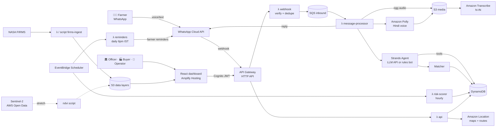

# 🌾 ClearSky

**Stop stubble fires before they start, by booking straw pickup over WhatsApp.**

> 🧰 **Setting up AWS, Bedrock, FIRMS, WhatsApp numbers or GitHub?** Follow [`SETUP_GUIDE.md`](SETUP_GUIDE.md).
>
> 🤖 **Using an AI assistant on this repo?** Read [`CONTEXT.md`](CONTEXT.md) first. It is the living summary of what's built, what's decided and what's next, and it is updated after every change.

> Others measure the smoke. We remove the reason to light the fire.

Built for **WeMakeDevs × AWS Environmental Hacks** (Bharat Builds Tour, Event 02, Oct 8–11, 2026). Track: **Air** (stubble burning). It also fits Waste & Energy (biomass).

---

## 1. The Problem

Every October–November, paddy stubble burning in Punjab and Haryana adds heavily to North India's smog.

- **Fires moved to the evening, not away.** Monitoring satellites (MODIS/VIIRS) observe between about 10:30 am and 1:30 pm. iFOREST found that **over 90% of large farm fires in Punjab in 2024–25 happened after 3 pm**, compared with 3% in 2021.
- **The burnt area is still large.** Punjab's burnt area was **~20,000 sq km in 2025**, down from a peak of 31,447 sq km in 2022, while official fire counts fell to 5,114.
- **The farmer's window is small.** There are only **20–25 days** between paddy harvest and wheat sowing.
- **Straw has no buyer at the right time.** For the farmer, collecting and transporting straw costs more than it earns. Industries that want biomass struggle to get **consistent supply**.
- **Demand is growing.** Industrial boilers' straw use went from 8.8 lakh tonnes (2022) to a projected 41 lakh tonnes (2025). Pellet plants went from 18 to 37. Thermal plants within 300 km of Delhi are asked to co-fire up to 10% biomass.
- **The machines exist.** Punjab has about 1,48,000 crop-residue-management machines and is targeting 1,500 custom hiring centres.

**The gap:** farmers, balers and buyers are not connected in time. It is a **logistics problem**, not an awareness problem.

---

## 2. The Solution

ClearSky is a **WhatsApp-first coordination system for farmers**, with a simple web dashboard for everyone else. It:

1. Lets a farmer register a field with **one voice note** in Hindi or Punjabi. The WhatsApp agent only talks to farmers: it collects their details and replies with a clear answer.
2. **Automatically books** the nearest free baler before the sowing deadline.
3. Gives **baler operators a simple dashboard** with their daily stops, a map, and a "Done" button per field.
4. **Routes the straw to a paying buyer** (pellet plant, CBG plant, boiler, or biomass/thermal plant).
5. Gives district officers a **Burn Risk Radar** that shows fields that are *harvested but not booked*, meaning fires that are likely to happen soon, and lets them dispatch help with one click.

---

## 3. Roles

| Role | Interface | Does | Gets |
|---|---|---|---|
| 👨‍🌾 **Farmer** | WhatsApp (voice/text) | Shares name, village, acres, harvest date; confirms harvest | Confirmed clearance date, payout or free clearance, reminders |
| 🚜 **Baler operator** (CHC) | Web dashboard (simple, mobile-first) | Signs in; sets machine capacity and availability; follows daily route; marks fields done | Full, clustered workdays |
| 🏭 **Buyer** | Web dashboard | Posts demand and price per tonne | Reliable straw supply and a forecast |
| 🏛️ **District officer** | Web dashboard (Burn Risk Radar) | Monitors risk; alerts villages; flags villages to nearby balers | Prevents fires instead of fining after |

**Channel rule:** WhatsApp is for **farmers only**. The agent's job is to collect the farmer's details, book through the backend, and reply properly (text, plus voice if they sent voice). Operators, buyers and officers never use WhatsApp; they use the dashboard.

---

## 4. Example

> **Gurpreet** (8 acres, Bhawanigarh) sends a voice note: *"Mera 8 acre dhaan 24 tareekh ko katega."* ("My 8 acres of paddy will be harvested on the 24th.")
> → The agent extracts 8 acres, harvest on Oct 24, and the village Bhawanigarh.
> → The matcher finds a CHC baler 6 km away, free on Oct 25, and clusters Gurpreet with 2 more fields in the same village.
> → It routes about 20 tonnes to a pellet plant 40 km away.
> → Gurpreet gets a Hindi voice reply: *"Aapka khet 25 tareekh ko saaf hoga. Koi kharcha nahi."* ("Your field will be cleared on the 25th. No cost.")
> → The baler operator opens the dashboard and sees Gurpreet's field as stop #2 on Oct 25.
> → Oct 24: reminder sent, Gurpreet replies "haan" (yes). Oct 25: field baled, operator taps **Done**, Gurpreet gets "Khet saaf ho gaya ✅". Straw delivered. **No fire.**
>
> Next door, **Harjit** harvested on Oct 22 and never booked. The radar marks the field **RED**. The officer clicks **Alert village**, Harjit gets a WhatsApp offer and books, and the pin turns **GREEN**.

---

## 5. Features

- 🎙️ **Voice-first WhatsApp bot for farmers**: Hindi voice in and out, Punjabi/Hindi/English text. No app, no login.
- 🤖 **AI agent** (Strands Agents with any LLM: OpenAI-compatible, Anthropic, Gemini or Amazon Bedrock) that collects the farmer's details from free-form messages, calls booking tools, and replies with only what the tools return. A deterministic **rules bot** (Hindi, Punjabi, Hinglish, English) works with no LLM at all and takes over if the LLM fails.
- 🧮 **Matching engine** that clusters fields by village, respects baler capacity and sowing deadlines, and picks the best buyer by net price and distance.
- 🔒 **Double-booking safe** through DynamoDB transactions with conditional capacity checks.
- ⏰ **Farmer reminders** on WhatsApp: a day-before harvest confirmation and a pickup notice.
- 🗺️ **Burn Risk Radar**: risk-scored fields, village risk, NASA FIRMS fire-history heatmap, and one-click village alerts.
- 🚜 **Operator dashboard**: sign in, see the day's stops on a map, tap "Done" per field, set capacity and availability, see villages the officer has flagged nearby.
- 🏭 **Buyer dashboard**: post demand, see the incoming tonnage forecast and deliveries.
- 📊 **Impact counters**: acres cleared, tonnes routed, farmer payouts, fires prevented.
- 🛰️ **(Stretch) Satellite harvest detection**: Sentinel-2 NDVI drop from AWS Open Data, which finds harvested land that isn't registered.
- 🎬 **Demo mode**: a simulated clock to replay a whole season in minutes.

---

## 6. Architecture



---

## 7. How We Used AWS

### AWS services (deployed: "Ship It")

| Service | What we use it for | Why |
|---|---|---|
| **Amazon Bedrock** *(optional)* | LLM behind the farmer agent when `LLM_PROVIDER=bedrock` (an external LLM API key is the default path) | Managed models, no infra, pay per call |
| **AWS Lambda** | Webhook, message processor, API, risk scorer, reminders, ingest | Serverless; costs nothing when idle |
| **Amazon API Gateway (HTTP API)** | WhatsApp webhook and dashboard REST API | Public HTTPS endpoint, JWT authorizer |
| **Amazon SQS** (+ DLQ) | Decouples webhook from slow processing | Meta needs a fast 200; voice processing takes seconds |
| **Amazon DynamoDB** | Farmers, fields, balers, buyers, bookings, capacity, conversations | Serverless; transactions prevent double booking |
| **Amazon Transcribe** | Hindi voice notes to text (`STT_PROVIDER=transcribe`; an OpenAI-compatible speech API also works) | Farmers speak, they don't type |
| **Amazon Polly** | Text to Hindi voice replies | Accessible for low-literacy users |
| **Amazon S3** | Voice media, FIRMS and satellite layers, transcripts | Cheap, durable storage |
| **Amazon EventBridge Scheduler** | Hourly risk scoring, daily reminders (IST timezone) | Managed cron |
| **Amazon Location Service** | Dashboard map tiles, operator route calculation, village geocoding | AWS-native maps and routing |
| **Amazon Cognito** | Officer, buyer and operator login, role groups | Managed auth with JWTs |
| **AWS Amplify Hosting** | React dashboard hosting with CI | One-command hosting |
| **AWS Systems Manager Parameter Store** | WhatsApp tokens and API keys (SecureString) | No secrets in code |
| **Amazon CloudWatch** | Logs, metrics, alarms | Debugging and reliability |

### AWS open-source tools ("Build It")

| Tool | Use |
|---|---|
| **Strands Agents SDK** | The farmer conversation agent and its tools (`register_field`, `book_pickup`, …) |
| **AWS SAM CLI** | Infrastructure as code (`template.yaml`), local invoke, one-command deploy |
| **Powertools for AWS Lambda (Python)** | Structured logging, tracing, idempotency helpers |
| *(optional)* **LocalStack** | Local DynamoDB/SQS during development |
| *(optional)* **Cedar** | Fine-grained authorization policies (officer sees own district only) |

### AWS Open Data (stretch)

- **Sentinel-2 L2A COGs** on the AWS Registry of Open Data, used to detect harvest (NDVI drop) for fields not registered in the system.

---

## 8. Tech Stack

- **Backend:** Python 3.12, Strands Agents SDK (OpenAI / Anthropic / Gemini / Bedrock), boto3, Powertools, Pydantic v2, rapidfuzz
- **Infra:** AWS SAM (`template.yaml`), arm64 Lambdas
- **Frontend:** React 19 + Vite + TypeScript, Tailwind CSS v4, MapLibre GL (OpenFreeMap or Amazon Location tiles), Recharts, TanStack Query, Amplify Auth; design system in `docs/design-system.md`
- **Data:** NASA FIRMS (VIIRS), Sentinel-2 (stretch), seeded demo data for one district (Sangrur)
- **Video:** Remotion + deck.gl screen captures

---

## 9. Repository Structure (monorepo)

Everything lives in **one repository**: backend, infra, dashboard, data, satellite and video. The root `Makefile` drives the backend and infra; the dashboard has its own `npm` scripts. One PR can change the API and the dashboard together.

```
clearsky/
├── README.md               ← you are here
├── CONTEXT.md              ← living project context for humans and AI assistants (update after every change)
├── IMPLEMENTATION.md       ← architecture, flows, data model, algorithms
├── PLAN.md                 ← phase-wise build plan (for team + Claude Code)
├── PROGRESS.md             ← per-phase log (created in Phase 0)
├── CLAUDE.md               ← instructions Claude Code reads automatically
├── AGENTS.md               ← same rules, for other AI coding tools
├── Makefile / make.ps1      ← root commands (install, lint, test, build, validate, seed, chat); make.ps1 = Windows
├── infra/
│   ├── template.yaml       ← SAM: all AWS resources
│   └── samconfig.toml
├── backend/
│   ├── pyproject.toml
│   ├── src/clearsky/
│   │   ├── config.py           clock.py          logging.py
│   │   ├── models/             (pydantic models)
│   │   ├── repo/               (DynamoDB repositories)
│   │   ├── domain/             (matching.py, pricing.py, risk.py, geo.py, villages.py)
│   │   ├── agent/              (agent.py, tools.py, prompts.py, memory.py)  ← farmer agent only
│   │   ├── channels/           (whatsapp.py, voice.py, templates.py)        ← WhatsApp = farmers only
│   │   ├── handlers/           (webhook.py, processor.py, api.py, risk_job.py, reminders.py, firms_ingest.py, health.py)
│   │   ├── seed/               (generate.py, load.py)
│   │   └── local.py            (in-process mock DynamoDB for offline dev)
│   ├── scripts/            (check_aws.py, gen_seed.py, seed_dynamo.py, chat_cli.py, book_all.py, fetch_firms.py, demo_clock.py)
│   └── tests/
├── data/
│   ├── seed/               (villages.json, balers.json, buyers.json, farmers.json, fields.json)
│   └── layers/             (firms_2022_2025.geojson, harvest_grid.geojson)
├── satellite/              (ndvi_harvest.py — stretch)
├── dashboard/              (React app: officer, buyer, operator, impact)
└── video/                  (Remotion project + storyboard)
```

---

## 10. Getting Started

### Prerequisites

- AWS account (Free Tier) with the AWS CLI configured (`aws configure`)
- Bedrock model access enabled in your region (see `PLAN.md` → Phase 0)
- [`uv`](https://docs.astral.sh/uv/) (it installs Python 3.12 for the project), Node 20+
- AWS SAM CLI (optional: `make.ps1` runs it through `uv tool run` if it isn't installed)
- Meta developer account with a WhatsApp Cloud API **test number**
- NASA FIRMS MAP_KEY (free)

Every command exists twice: `make <target>` on macOS/Linux and `.\make.ps1 <target>` on Windows.

### Setup

```bash
git clone <repo> && cd clearsky
cp .env.example .env            # fill in values (never commit .env); see SETUP_GUIDE.md

make install                    # uv sync (Python 3.12 venv in backend/.venv)
make lint && make test          # ruff + mypy, pytest (no AWS needed)
make check-aws                  # ✅/❌ readiness table (read-only, free)

# the whole system on your machine (no AWS, no keys): API + mock DB + WhatsApp simulator
make dev                        # terminal 1: backend dev server on :8787
make dashboard                  # terminal 2: dashboard on http://localhost:5173
make e2e                        # Playwright smoke tests of the full loop
make chat                       # farmer agent in the terminal (rules bot, or your LLM via .env)
make book-all                   # matcher dry run over the seed

# store secrets (WhatsApp, FIRMS) in SSM
./scripts/put_secrets.sh

# deploy (team approval required; creates AWS resources)
make validate && make deploy CONFIRM=yes        # Windows: .\make.ps1 deploy -Confirm yes
make seed                       # load the seed into the deployed tables (deletes existing items)

# dashboard (Phase 7)
cd dashboard && npm i && npm run dev
```

### Connect WhatsApp

1. Meta App → WhatsApp → Configuration → Webhook URL = `<ApiUrl>/webhook/whatsapp`, verify token = `WA_VERIFY_TOKEN`.
2. Subscribe to the `messages` field.
3. Add your team's phone numbers as test recipients (test numbers allow up to 5). These act as demo **farmers**; operators use the dashboard, not WhatsApp.
4. Create message templates `pickup_reminder` and `village_alert` (needed for messages sent outside the 24-hour window).

---

## 11. Configuration

| Variable | Example | Purpose |
|---|---|---|
| `AWS_REGION` | `ap-south-1` | Deployment region |
| `BEDROCK_MODEL_ID` | *(team decides)* | Agent model |
| `WA_PHONE_NUMBER_ID` | SSM | WhatsApp sender |
| `WA_ACCESS_TOKEN` | SSM | Graph API token |
| `WA_APP_SECRET` | SSM | Webhook signature check |
| `WA_VERIFY_TOKEN` | SSM | Webhook verification |
| `WA_API_VERSION` | `v23.0` (verify) | Graph API version |
| `FIRMS_MAP_KEY` | SSM | NASA FIRMS |
| `TRANSCRIBE_LANGUAGE` | `hi-IN` | Voice language |
| `POLLY_VOICE` | `Kajal` | Voice reply |
| `TONNES_PER_ACRE` | `2.5` | Straw yield estimate |
| `SOWING_WINDOW_DAYS` | `20` | Default harvest → sowing |
| `SEASON_SOWING_CUTOFF` | `2026-11-15` | Hard cutoff |
| `DEMO_MODE` | `true` | Enables simulated clock |

Full list: `IMPLEMENTATION.md` §13.

---

## 12. Demo Script (3 min)

| Time | Scene |
|---|---|
| 0:00–0:20 | Fire map at 1:30 pm (few dots), clock spins to 5 pm, map erupts. *"The satellite looks away. The smoke doesn't."* |
| 0:20–0:45 | Split screen: farmer with straw and a countdown, plant with an empty yard. *"Not a pollution problem. A logistics problem."* |
| 0:45–1:50 | Real phone: farmer voice note → voice reply → booking. Operator dashboard shows the new stop. Buyer forecast. Animated trucks (deck.gl TripsLayer). |
| 1:50–2:20 | Burn Risk Radar: red fields, "Alert village", turns green. |
| 2:20–2:40 | AWS architecture lights up along one message's path. |
| 2:40–3:00 | Impact counters. Closing line. |

---

## 13. Impact Metrics (shown live)

- Acres registered / booked / cleared
- Tonnes of straw routed to buyers
- Total farmer payouts (₹)
- Fields moved from RED to GREEN after officer alerts
- Estimated emissions avoided (using a published emission factor; the source is cited in-app)

---

## 14. Roadmap

- Punjabi voice replies (when a TTS voice is available)
- Satellite harvest detection across a whole district, with Sentinel-1 radar for haze days
- Combine-harvester operator reporting
- Payment rails (UPI payouts) and buyer contracts
- State and CAQM data integration; multi-district rollout
- Wheat-residue season support

---

## 15. Team

| Member | Owns |
|---|---|
| Akshay | WhatsApp farmer bot + agent |
| P2 | Matcher, bookings, data, REST API |
| P3 | Dashboard (radar, buyer, operator) |
| P4 | Video, blog, testing |

---

## 16. Sources

- Tribune: Satellites miss majority of stubble fires (iFOREST report): https://www.tribuneindia.com/news/delhi/satellites-miss-majority-of-stubble-fires-delhi-air-pollution-underestimated-report
- Tribune: Farm fires down as season nears end: https://www.tribuneindia.com/news/punjab/farm-fires-down-to-50-as-season-nears-end
- Tribune: Lok Sabha reply on farm fires: https://www.tribuneindia.com/news/india/punjab-haryana-record-90-per-cent-fewer-farm-fire-incidents-in-2025-govt-in-lok-sabha/amp
- ICC / Vedanta TSPL: paddy straw supply chain: https://iccwbo.org/news-publications/guest-blog/the-last-straw-indias-burning-fields-turn-into-an-energy-opportunity/
- Outlook Business: evening burning detection gap: https://www.outlookbusiness.com/news/punjab-haryana-evening-stubble-burning-detection-gap-delhi-pollution

## License

MIT
