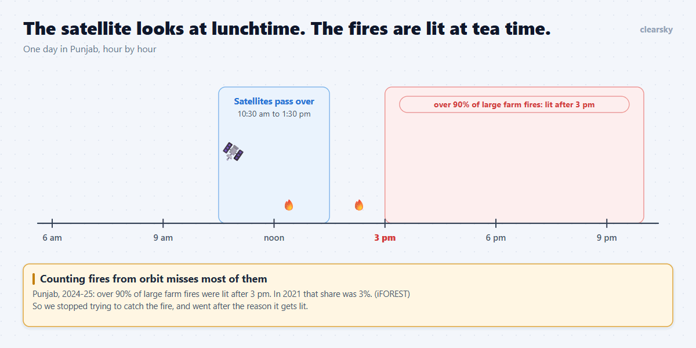
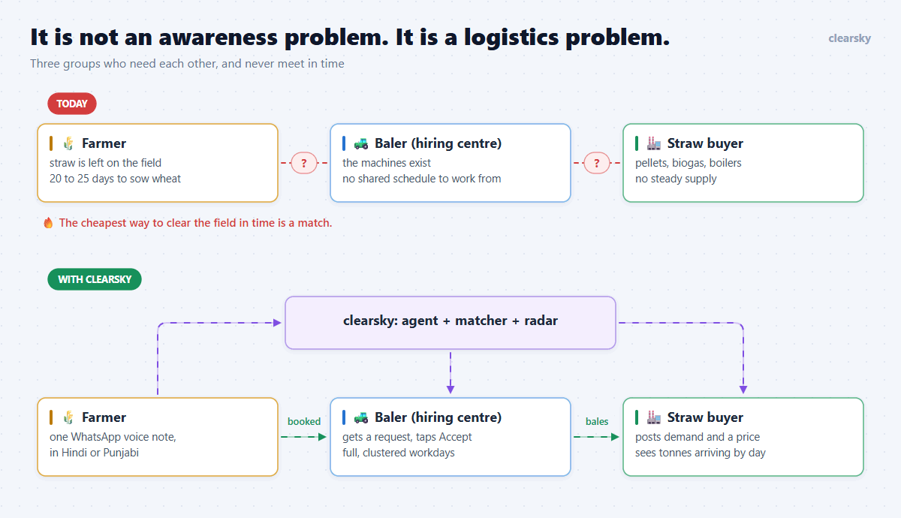
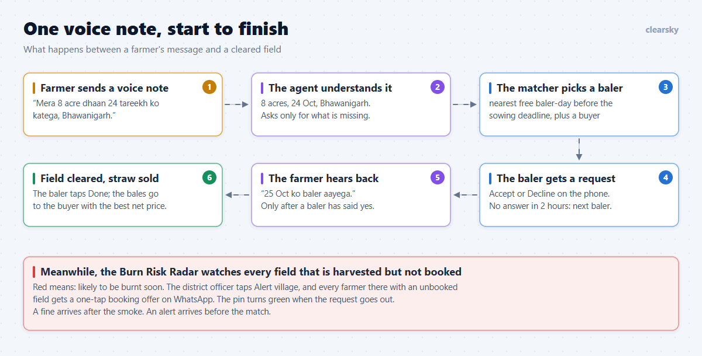
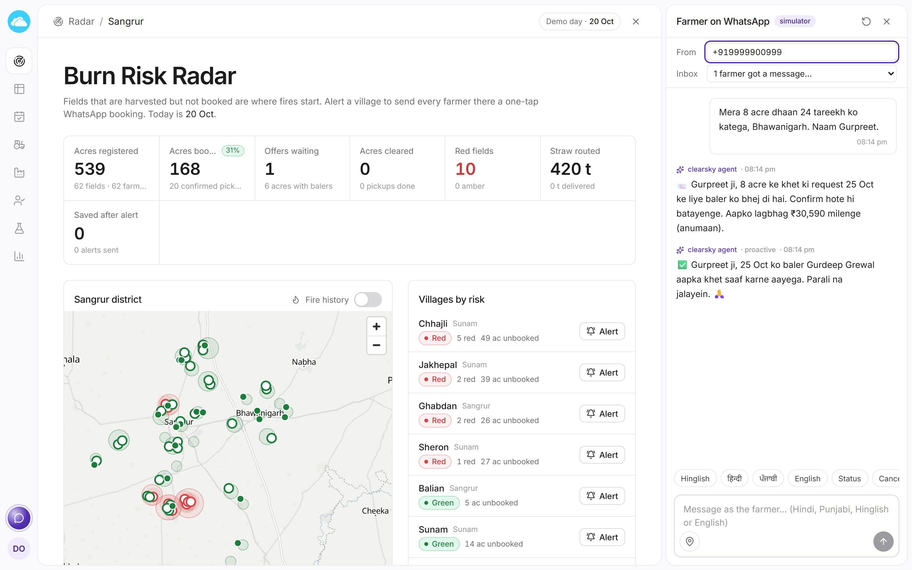
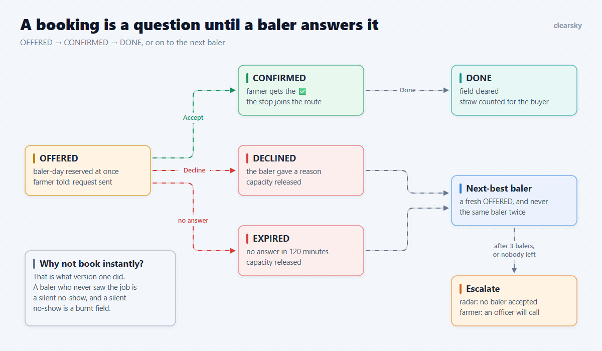
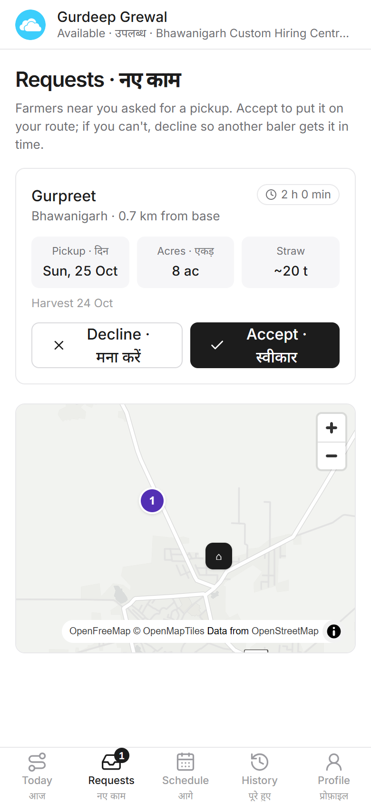
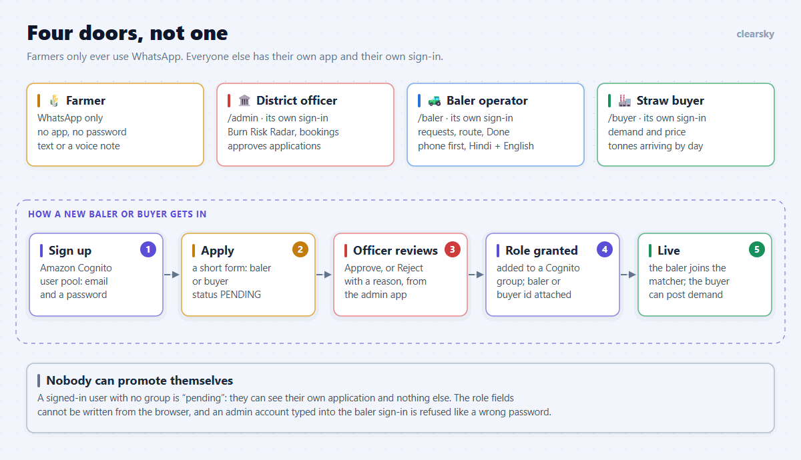
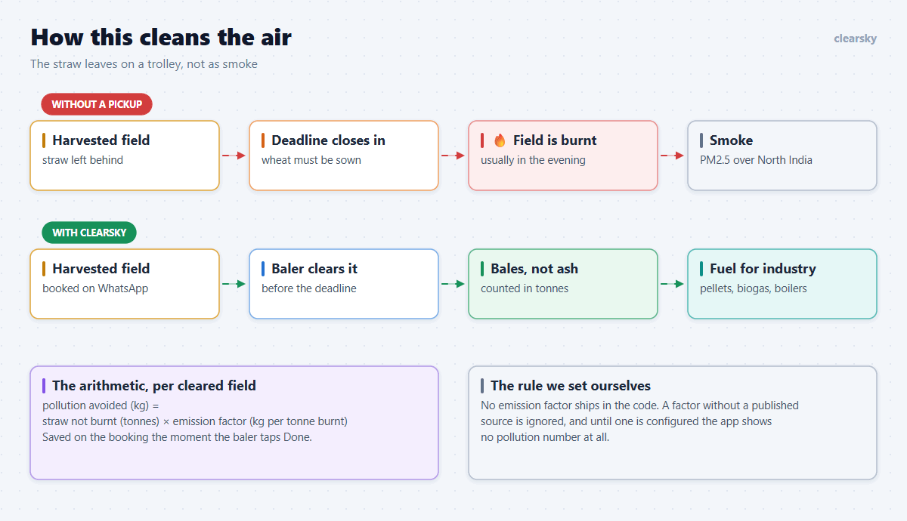
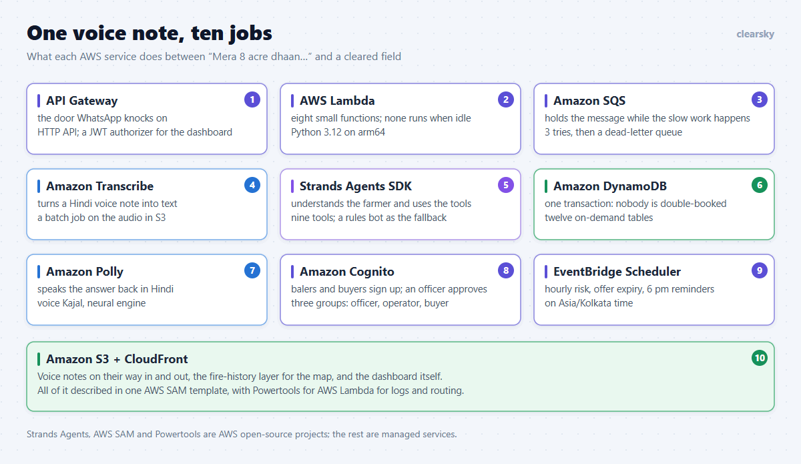

# The fire starts at 5 pm. The satellite left at 1:30.

*clearsky books a baler for a paddy field over WhatsApp, before anyone reaches for a match. We built it in four days for the Air track of WeMakeDevs × AWS Environmental Hacks. This is the problem, the stack, and what fought back.*

---

**Our first working version lied to a farmer.**

He was a test farmer, thankfully. Gurpreet sent one message: eight acres of paddy, harvest on the 24th, village Bhawanigarh. Within seconds the bot answered, in his own Hinglish: *"✅ Gurpreet ji, 8 acre ka khet 25 Oct ko saaf hoga."* Your field will be cleared on the 25th.

Every test was green. The booking was in the database. The baler's day had the acres reserved.

Nobody had asked the baler.

He would find out when he opened his dashboard, if he opened it. Put a real farmer in Gurpreet's place and a baler whose machine is in pieces that week: the farmer waits on a promise made of nothing, the sowing deadline arrives, and the field burns. We had built a faster way to cause the exact thing we were trying to stop.

That bug changed what clearsky is. But to explain why it mattered so much, I have to start with a satellite.

## Part one: the problem is not the fire

Every October and November, paddy stubble burning in Punjab and Haryana adds heavily to North India's smog. The official answer has been to count fires from orbit and fine the farmers underneath them.

The satellites that do the counting (MODIS and VIIRS) pass over between about 10:30 am and 1:30 pm. A study by iFOREST found that **over 90% of the large farm fires in Punjab in 2024-25 were lit after 3 pm**. In 2021 that share was 3%.

The fires did not go away. They moved to tea time.



So the official fire count fell to 5,114, while Punjab's burnt area was still about 20,000 square kilometres in 2025 (down from a peak of 31,447 in 2022). You cannot fix what you are structurally unable to see.

We decided not to build a better fire detector. Everyone at an environmental hackathon builds a detector. We asked a different question: **why does a farmer light the field at all?**

## Part two: it is a logistics problem

A paddy farmer has 20 to 25 days between harvesting rice and sowing wheat. The straw left on the field is in the way. Collecting and transporting it costs him more than it earns him. A match costs nothing and takes an evening.

Meanwhile, the other two people in this story are stuck too:

- **Balers exist.** Punjab has about 1,48,000 crop-residue machines and is aiming for 1,500 custom hiring centres. But there is no shared schedule that tells a baler which field is ready tomorrow, two villages away.
- **Buyers exist.** Industrial boilers' straw use went from 8.8 lakh tonnes in 2022 to a projected 41 lakh tonnes in 2025. Pellet plants went from 18 to 37. Thermal plants within 300 km of Delhi are asked to co-fire up to 10% biomass. What these plants cannot get is *steady* supply.

Three groups who need each other, and never meet in time.



That is the whole idea behind clearsky. Others measure the smoke. We remove the reason to light the fire.

## Part three: one voice note, start to finish

A farmer does not install anything and does not log in to anything. He sends a WhatsApp message or a voice note, in Hindi, Punjabi, Hinglish or English. That is his entire interface.



Behind that message:

1. An **agent** (built on the Strands Agents SDK) pulls out the village, the acres and the harvest date, and asks only for what is missing, one question at a time.
2. A **matcher** finds the nearest baler with a free day before the sowing deadline. It prefers a baler who already has a stop in the same village, because a clustered day is a cheaper day.
3. The straw is routed to the **buyer with the best net price** after transport.
4. The farmer gets a date. The baler gets a stop. The buyer gets a forecast.

Farmers only ever use WhatsApp. Everyone else uses a web dashboard: the district officer, the baler operator and the buyer each get their own app.

Here is the officer's screen with the farmer's WhatsApp chat docked beside it. This is real output from our local demo data (the people are synthetic, and the rupee amounts are demo prices, not market rates):



The map is the other half of the product. The **Burn Risk Radar** marks every field that is *harvested but not booked*, scored by how close the sowing deadline is, whether any baler is still free, and how often that village has burnt before (from NASA FIRMS fire data). Red means "this field is likely to be burnt soon." The officer taps **Alert village**, and every farmer there with an unbooked field gets a one-tap booking offer on WhatsApp.

A fine arrives after the smoke. An alert arrives before the match.

## Part four: the promise we had to stop making

Back to the lie.

Booking instantly looked great in a demo. But a real custom hiring centre has to be able to say no: the machine is broken, the field is too far off the road, the day is already full. A system that cannot hear "no" will keep telling farmers "yes".

So we rebuilt the booking as a question.



A new booking is now an **offer** to the best baler. The baler-day is reserved immediately, so two offers can never overbook it, but the farmer is told only this:

> 📨 Gurpreet ji, 8 acre ke khet ki request 25 Oct ke liye baler ko bhej di hai. Confirm hote hi batayenge.
>
> *(Your request for the 25th has been sent to a baler. We will tell you as soon as it is confirmed.)*

The baler sees it on his phone, with a countdown:



**Accept**, and only then does the farmer get the ✅ with the baler's name. **Decline** (with a reason), or stay silent for two hours, and the offer moves to the next-best baler. The one who refused is never asked about that field again. After three balers, or when nobody is left, the field goes onto the officer's radar marked "no baler accepted", and the farmer is told an officer will follow up.

We also had to teach the bot to stop sounding sure. The ✅ emoji is now reserved for one event: a human baler said yes. Everything before that is a 📨.

This was the most important change we made all week, and it removed our prettiest demo moment. I would make the same trade again.

## Part five: four doors, not one

My part of the build was everything after the WhatsApp message: the screens the baler, the buyer and the district officer live in.

The first version had one login page with a role picker. That is fine for a hackathon and wrong for the real world, where a baler operator on a cheap Android phone and a district officer on a desktop want nothing in common. So each role got its own app, its own address and its own sign-in page: the admin's is not even linked from the public site. An admin account typed into the baler's login is refused with the same message as a wrong password.



Balers and buyers can also **register themselves**. They sign up with an email and a password (an Amazon Cognito user pool), fill in a short form, and wait. The district officer sees the application in the admin app and approves or rejects it with a reason.

Approval does three things in a fixed order: it creates the baler or buyer record, it adds the person to a Cognito group and attaches their baler or buyer id to the account, and only then marks the application approved. If the Cognito step fails halfway, the application simply stays pending and the officer presses Approve again. Both calls are safe to repeat.

Until that moment, the account can sign in but can do nothing except look at its own application. The role fields on the account cannot be written from the browser at all. Nobody has to create accounts by hand, and nobody can make themselves an admin.

The baler app is deliberately plain: big buttons, Hindi next to English on every action, and nothing that scrolls sideways on a 390-pixel screen.

## Part six: how this actually cleans the air

The Air track asks teams to "change what happens on the bad days." Our claim is simple, and I want to be careful about how far it goes.



**Straw that is baled is straw that is not burnt.** Every field clearsky clears before the deadline is a field whose farmer no longer has a reason to light it. That is PM2.5, carbon monoxide and soot that never enters the evening air over North India, on exactly the days the AQI is worst. And the straw does not vanish: it becomes pellets, compressed biogas or boiler fuel.

The app works this out per field, the moment the baler taps **Done**:

```
pollution avoided (kg) = straw not burnt (tonnes) × emission factor (kg per tonne burnt)
```

Then it shows the result everywhere: on a public impact page, to the officer, to the baler ("your work kept this much out of the air"), to the buyer, and in the farmer's "field cleared" message.

Here is the part I am proudest of. **There is no emission factor in our code.** It would have taken thirty seconds to paste in a number that looked right, and the counter on the impact page would have looked wonderful in the video. Instead the factor is a setting that must come from a published paper, and it must carry its citation. A factor with no source is ignored. Until the team has agreed on one, the app shows no pollution number at all, and tells the admin why.

A project about air quality that invents its air-quality numbers has already lost the argument.

What we can honestly claim today: the mechanism is real, the booking loop works end to end on a deployed stack, and the arithmetic is one config value away from being switched on. What we cannot claim: a measured drop in anyone's AQI. That needs a season in a real district.

## What fought back

**A price field that refused ₹1,700.** Our browser test for buyer registration filled the form perfectly and then sat there. No error, no request. The price input had `min=1` and `step=10`, so the browser would only accept 1, 11, 21, 31. A round number like 1,700 was "invalid", silently. The same bug had been sitting in the buyer's demand form the whole time.

**A route for the wrong day.** One end-to-end test failed only when the whole suite ran. The baler's screen showed "0 stops" on a day that had one. The cause was our local dev server: it handled requests on several threads, but the Lambda framework keeps "the current request" on one shared object. Two parallel requests were reading each other's query string. Real Lambda never does this, because one instance handles one event at a time. We made the dev server do the same.

**A test that slept.** An older test clicked "next day" and waited 600 ms, ten times, hoping to land on the right date. It passed until, one afternoon, it did not. The fix was not a longer sleep. The route page learned to open on a date from its URL, which is also how the Schedule tab now links into it.

**The temptation to guess.** See part six. The hardest thing that fought back was not technical.

## What it runs on: one voice note, ten jobs

Everything is serverless, so between two messages nothing runs and nothing is billed. Here is the same voice note again, this time following the AWS service that handles each step.



**1. Amazon API Gateway** is the address we gave Meta. WhatsApp's Cloud API posts every farmer message to one route on an HTTP API. The dashboard's REST API sits behind the same gateway, with a Cognito JWT authorizer in front of it.

**2. AWS Lambda** does all the computing: eight small functions on Python 3.12 and arm64. The first one, the webhook, has ten seconds and one job. It checks Meta's signature on the message, makes sure this message id has not been seen before, and passes it on.

**3. Amazon SQS** is where it passes it. WhatsApp wants an answer in a moment, and a voice note can take the better part of a minute, so a queue sits between the two. If a message fails three times it moves to a dead-letter queue and a CloudWatch alarm emails the team. A farmer's message is never silently dropped.

**4. Amazon Transcribe** is how a voice note becomes words. A second Lambda downloads the audio from WhatsApp, saves it to a private S3 bucket and starts a Hindi transcription job:

```python
tr.start_transcription_job(
    TranscriptionJobName=name,
    Media={"MediaFileUri": f"s3://{s.media_bucket}/{key}"},
    MediaFormat="ogg",
    LanguageCode=s.transcribe_language,  # "hi-IN"
    OutputBucketName=s.media_bucket,
    OutputKey=out_key,
)
```

A WhatsApp voice note arrives as an Ogg file, and we hand that file to Transcribe exactly as it is. There is no audio conversion anywhere in the pipeline. Because this is a batch job and not an instant answer, the farmer first gets *"🎙️ Sun raha hoon…"* (I am listening), so the chat is never silent while the work happens.

**5. The Strands Agents SDK** runs the conversation. The agent has nine tools: look up the farmer, resolve a village name, register a farmer, register a field, book a pickup, list bookings, confirm a harvest, reschedule, cancel. The farmer's phone number is not something the model can type. Each tool is built for the one person who sent the message, so a confused model can still only act for that person.

**6. Amazon DynamoDB** holds everything, in twelve on-demand tables. A booking is a single transaction that reserves the baler's day, writes the booking, updates the field and reserves the buyer's tonnes. Either all four happen or none do, which is what makes it impossible to promise one baler-day to two farmers.

**7. Amazon Polly** speaks the answer. If the farmer sent a voice note, the reply text is also turned into Hindi speech (the neural voice Kajal), saved to S3 as an mp3, and sent back as a WhatsApp voice note. A farmer who would rather talk than type never has to read a word.

**8. Amazon Cognito** is the sign-in for everyone who is not a farmer: one user pool, three groups (officer, operator, buyer), and the self-registration flow from part five.

**9. Amazon EventBridge Scheduler** keeps three clocks. Every hour it re-scores the burn risk of every field. Every fifteen minutes it looks for offers that no baler answered and moves them on. At 6 pm India time it sends tomorrow's reminders: *"Kal katai?"* (harvest tomorrow?) with yes and no buttons, and *"Kal baler aayega"* (the baler comes tomorrow).

**10. Amazon S3 and CloudFront** store the voice notes on their way in and out (deleted after seven days), the fire-history layer behind the map, and the dashboard itself.

Around all of it: **AWS SAM** describes the whole stack in one template, **Powertools for AWS Lambda** gives us structured logs and the HTTP routing, secrets live in **SSM Parameter Store** and never in the repository, and GitHub Actions deploys from `main` through OIDC, so there is no AWS access key stored anywhere.

My teammate's post goes deep on the architecture, the voice pipeline and the deployment, with the code. This one is about why the thing exists.

## Three things I would tell myself on day one

1. **Find the sentence your product is not allowed to say.** Ours was "your field will be cleared" before a human had agreed to clear it. Most of our best design came from refusing to say it early.
2. **A demo that cannot fail is hiding something.** Instant booking never failed. That was the problem.
3. **If a number matters, make it impossible to fake.** We could not stop ourselves by promising to be careful. We could only stop ourselves by writing code that ignores a number without a source.

The satellite will keep looking away at 1:30. That is fine. By 5 pm, we want there to be nothing left to burn.

---

**Try it**

- Live: https://clearsky.akkki.tech
- Code: https://github.com/sanskarjoshiii/clearsky
- Demo video: *(add the video link here)*

Built by Team Atherion (Sanskar, Kamran, Akshay and Anushka) for the WeMakeDevs × AWS Environmental Hacks, Air track, 8-11 October 2026.

**Sources for the numbers in this post**

- iFOREST findings on fire timing and burnt area, as reported by The Tribune: https://www.tribuneindia.com/news/delhi/satellites-miss-majority-of-stubble-fires-delhi-air-pollution-underestimated-report
- The Tribune, farm fires as the season ends: https://www.tribuneindia.com/news/punjab/farm-fires-down-to-50-as-season-nears-end
- Outlook Business, the evening detection gap: https://www.outlookbusiness.com/news/punjab-haryana-evening-stubble-burning-detection-gap-delhi-pollution
- ICC, the paddy straw supply chain: https://iccwbo.org/news-publications/guest-blog/the-last-straw-indias-burning-fields-turn-into-an-energy-opportunity/
- Fire history on the radar: NASA FIRMS (VIIRS), October-November 2022 to 2025.

Screenshots show synthetic demo farmers and demo prices. No real farmer data appears in this post.
